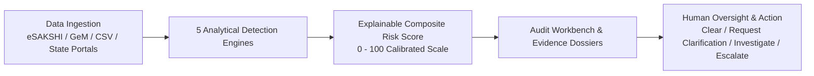
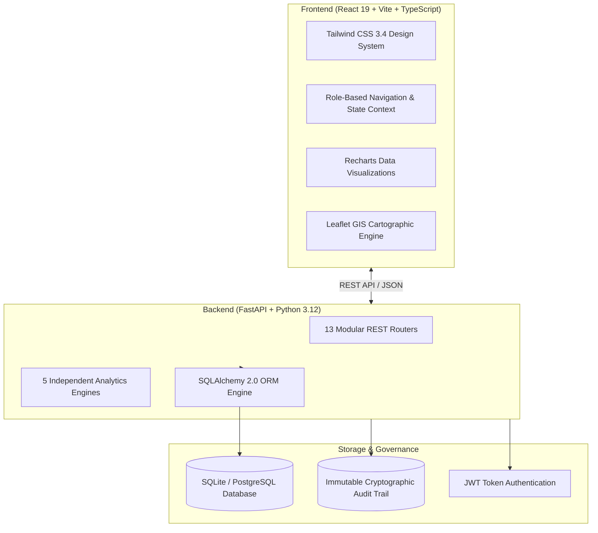

> **Public prototype:** [Launch NIRIKSHAN on Render](https://nirikshan-sih-102.onrender.com/official-data)
>
> **Local prototype:** Double-click `Start-Prototype.cmd` and open http://127.0.0.1:8102. See [PROTOTYPE.md](PROTOTYPE.md) for demo credentials and the presentation flow.

<p align="center">
  <a href="LICENSE"></a>
  
  
  
  
  
  
</p>

<h1 align="center">
  🛡️ NIRIKSHAN
</h1>

<h3 align="center">
  <em>MPLADS Intelligence & Multi-Signal Risk Monitoring Platform</em>
</h3>

<p align="center">
  An AI-powered decision-support platform enabling district oversight authorities, state nodal departments, and auditors to continuously monitor public works, detect procurement price inflation, uncover contractor cartelization, flag duplicate projects, and enforce fiscal accountability.
</p>

<p align="center">
  <a href="#-the-real-world-problem">Problem</a> •
  <a href="#-solution-overview">Solution</a> •
  <a href="#-detection-engines">Detection Engines</a> •
  <a href="#-architecture">Architecture</a> •
  <a href="#-core-modules">Core Modules</a> •
  <a href="#%EF%B8%8F-quick-start">Quick Start</a> •
  <a href="#-api-reference">API</a> •
  <a href="#-project-structure">Structure</a> •
  <a href="#-license">License</a>
</p>

---

## 🎯 The Real-World Problem

### What is MPLADS?
The **Members of Parliament Local Area Development Scheme (MPLADS)** entitles each of India's **788 Members of Parliament** (543 Lok Sabha + 245 Rajya Sabha) to recommend developmental works to the tune of **₹5 crore annually** within their constituencies. These funds finance vital durable local public infrastructure—drinking water projects, public schools, primary health centers, rural road networks, sanitation facilities, and community centers.

Annually, this translates to over **21,000+ newly sanctioned projects** and an active capital pipeline exceeding **₹12,500+ crores**.

### The Oversight Bottleneck
Traditional public works audit and monitoring mechanisms face severe structural bottlenecks:

| Audit Challenge | Practical Ground Reality |
|---|---|
| **Massive Transaction Volume** | Tens of thousands of active works spread across 773 administrative districts nationwide. |
| **Severe Manpower Constraints** | A District Authority (DA) often oversees 500+ concurrent works alongside general revenue administration. |
| **Post-Facto Discovery Delay** | Irregularities are typically uncovered by statutory audits or state inspection teams **12 to 24 months after fund disbursement**. |
| **Information Silos** | Tender records, measurement books, eSAKSHI data drops, GeM price catalogs, and geotagged site photographs exist in disjointed systems. |

### Documented Public Audit Findings
Independent public audit reports consistently highlight recurring vulnerabilities in decentralized infrastructure programs:
- **Procurement Price Inflation:** Standard materials (LED solar streetlights, HDPE piping, submersible pumps, paver tiles) billed at **25%–80% above standard Government e-Marketplace (GeM)** benchmarks.
- **Contractor Cartelization / Monopolies:** Single vendor syndicates winning a disproportionate share of local works through non-competitive bidding, with Herfindahl-Hirschman Index (HHI) values exceeding critical market concentration thresholds.
- **Duplicate Claims & Reused Assets:** Multiple fund sanctions disbursed for identical physical locations using recycled site inspection photographs or overlapping geospatial coordinates.
- **Statistical Allocation Outliers:** High-value works sanctioned with budgets deviating drastically from statistical norms of comparable works in the same district cohort.

> **Design Principle:** NIRIKSHAN is an **explainable decision-support platform**. It does not substitute human executive authority; rather, it autonomously prioritizes high-risk works, compiles forensic evidence receipts with mathematical and visual proof, and empowers authorized officers to make informed audit determinations.

---

## 💡 Solution Overview

NIRIKSHAN transforms public oversight from reactive, sample-based audits to **continuous, automated, multi-signal risk monitoring**:



1. **100% Coverage:** Every ingested work is scored across 5 independent risk dimensions without sampling gaps.
2. **Deterministic & Explainable:** Every flagged anomaly includes raw benchmark tables, statistical distribution curves, and side-by-side photo comparisons.
3. **Optimized Audit Capacity:** Oversight teams triage cases by risk severity, focusing investigation efforts on the top 1%–5% most critical anomalies.

---

## 🔬 Detection Engines

Each public work is evaluated by **five independent, mathematically grounded detection engines**:

### 1. GeM Price Benchmarking Engine
* **Objective:** Detect procurement rate inflation compared against Government e-Marketplace (GeM) standard benchmarks.
* **Algorithm:** High-speed fuzzy token-sort ratio string matching via `rapidfuzz` against standardized material catalogs.
* **Risk Logic:** Computes percentage variance for each material line item:
  $$\text{Variance \%} = \frac{\text{Billed Unit Price} - \text{GeM Benchmark Price}}{\text{GeM Benchmark Price}} \times 100$$
  * $+15\% \text{ to } +30\% \rightarrow \text{Moderate Risk}$
  * $> +30\% \rightarrow \text{Severe Risk (Flags work for technical audit)}$

### 2. Statistical IQR Cohort Outlier Engine
* **Objective:** Uncover anomalous project allocations relative to peer works within the same district and asset category.
* **Algorithm:** Non-parametric Interquartile Range (IQR) analysis calculating quartiles ($Q_1, Q_3$), median, and standard outlier boundaries:
  $$\text{IQR} = Q_3 - Q_1$$
  $$\text{Upper Threshold} = Q_3 + 1.5 \times \text{IQR}$$
* **Risk Logic:** Normalizes deviations beyond the upper whisker into a standardized 0–100 outlier score.

### 3. Benford's Law Financial Analysis Engine
* **Objective:** Detect unnatural digit distributions, artificial transaction structuring, and round-number bias in expenditure records.
* **Algorithm:** Evaluates first-digit frequencies against Benford's logarithmic distribution ($P(d) = \log_{10}(1 + 1/d)$) using Mean Absolute Deviation (MAD):
  $$\text{MAD} = \frac{1}{9} \sum_{d=1}^9 |P_{\text{observed}}(d) - P_{\text{expected}}(d)|$$
* **Risk Logic:** Audit non-conformity flagged when $\text{MAD} > 0.015$.

### 4. Vendor Concentration (HHI) Engine
* **Objective:** Prevent contractor monopolization and detect cartelization in public procurement.
* **Algorithm:** Herfindahl-Hirschman Index computed across contractor shares within each district-category cohort:
  $$\text{HHI} = \sum_{i=1}^N \left(\frac{\text{Vendor Expenditure}_i}{\text{Total Cohort Expenditure}} \times 100\right)^2$$
* **Risk Logic:** Markets with $\text{HHI} > 2,500$ signify high market concentration and trigger procurement scrutiny.

### 5. Multi-Modal Duplicate Detection Engine
* **Objective:** Prevent duplicate disbursements and identify ghost assets claiming existing infrastructure.
* **Algorithm:** Tri-modal verification fusing:
  - **Perceptual Image Hashing (pHash):** 64-bit DCT-based image fingerprinting measuring normalized Hamming distance between site photographs.
  - **Haversine Geo-Fencing:** Spherical distance calculation flagging co-located projects within $\le 250\text{ meters}$.
  - **Semantic Scope Alignment:** Token matching on sanctioned scope descriptions and financial allocations.
* **Risk Logic:** Confidence scores $\ge 75\%$ flag candidate pairs for side-by-side photo inspection.

### Composite Risk Scoring Formula
The individual engine outputs are synthesized into a single, calibrated **0–100 Composite Risk Score**:

$$\text{Composite Risk} = \sum_{i=1}^5 w_i \times S_i$$

| Engine | Default Weight | Description |
|---|---|---|
| **GeM Price Variance** | **30%** | Procurement rate inflation against benchmark schedules |
| **Statistical IQR Outlier** | **20%** | Allocation deviation from district category cohort |
| **Benford's Law Conformity** | **15%** | Irregular financial digit distribution |
| **Vendor Concentration (HHI)** | **15%** | Contractor market dominance and cartel risks |
| **Multi-Modal Duplicate Detection** | **20%** | Reused site photography and co-located coordinates |

---

## 🏗 Architecture

NIRIKSHAN is designed with a modern decoupled architecture: a high-performance **FastAPI (Python 3.12)** backend and a responsive **React 19 + TypeScript** client:



---

## ✨ Core Modules

1. **Command Center:** Executive oversight dashboard displaying portfolio KPIs, multi-district expenditure totals, risk distributions, 17-month financial trends, and priority audit targets.
2. **Works Explorer:** Real-time multi-dimensional data grid with instant search, category filtering, district selectors, risk tier filtering, and CSV export.
3. **Deep-Dive Work Investigation:** Complete project dossiers showing sanctioned vs expenditure amounts, contractor details, item-level BOQs, and milestone timelines.
4. **Forensic Evidence Dossiers:** Detailed breakdown of engine metrics, raw benchmark tables, IQR quartile distributions, and Benford conformity curves.
5. **Price Intelligence:** Macro price variance analysis, GeM benchmark lookup table, and Gaussian bell curve distribution for material rate spreads.
6. **Duplicate Detection Workspace:** Side-by-side visual photo comparison with perceptual similarity scores, GPS distance offsets, and verification tools.
7. **Geographic Intelligence (GIS):** Interactive map showing district-level risk choropleths, project clusters, and regional concentration heatmaps.
8. **Review Queue:** Role-tailored case management queue enabling officers to record audit rulings (*Investigation Required*, *Cleared*, *Escalated*).
9. **Data Ingestion Pipeline:** Automated ingestion and normalization pipeline for eSAKSHI data drops, BoQ schedules, and GeM reference catalogs.
10. **Reports & Exports:** One-click generation and streaming export of executive summaries, risk registers, and audit packages.
11. **Immutable Audit Trail:** Append-only cryptographic ledger tracking all user logins, risk assessments, reviewer determinations, and engine configuration adjustments.

---

## ⚡️ Quick Start

### Prerequisites
- **Python 3.12+** ([python.org](https://www.python.org/))
- **Node.js 20+** and **npm** ([nodejs.org](https://nodejs.org/))
- **Git** ([git-scm.com](https://git-scm.com/))

---

### Step 1: Clone Repository
```bash
git clone https://github.com/QuorLum/NIRIKSHAN.git
cd NIRIKSHAN
```

### Step 2: Backend Setup
```bash
cd NIRIKSHAN/backend

# Create and activate Python virtual environment
python -m venv .venv

# On Windows:
.venv\Scripts\activate
# On Linux / macOS:
# source .venv/bin/activate

# Install dependencies
pip install -r requirements.txt

# Launch FastAPI backend server
python main.py
```
> The API server starts on **http://127.0.0.1:8000**.  
> The canonical demo dataset is automatically seeded on the initial launch.  
> Verify API health: [http://127.0.0.1:8000/api/health](http://127.0.0.1:8000/api/health)

### Step 3: Frontend Setup
In a separate terminal:
```bash
cd NIRIKSHAN/frontend

# Install frontend dependencies
npm install

# Launch Vite development server
npm run dev
```
> Open your browser at **http://localhost:5173** to access the dashboard.

---

## 🧪 Testing & Verification

The test suite validates detection engines, edge cases, and API routes:

```bash
# Run backend pytest suite
cd NIRIKSHAN/backend
.venv\Scripts\activate
pytest tests/ -v

# Verify frontend TypeScript build
cd ../frontend
npm run build
```

---

## 📡 API Reference

Interactive API documentation with full OpenAPI 3.0 schemas is available at:
- **Swagger UI:** `http://127.0.0.1:8000/docs`
- **ReDoc:** `http://127.0.0.1:8000/redoc`

| Method | Endpoint | Description |
|---|---|---|
| `GET` | `/api/health` | Service health status, database connection, and engine readiness |
| `GET` | `/api/dashboard/stats` | Macro portfolio statistics (Total Works, Expenditure, Risk Counts) |
| `GET` | `/api/dashboard/charts` | Time-series expenditure, risk tier distribution, and category breakdowns |
| `GET` | `/api/works` | Paginated works registry with state, district, risk, and category filters |
| `GET` | `/api/works/{code}` | Comprehensive work record with BoQ items, milestones, and metadata |
| `GET` | `/api/works/{code}/evidence`| Forensic evidence package containing metrics from all 5 detection engines |
| `GET` | `/api/reviews` | Prioritized review queue with SLA tracking and risk tabs |
| `POST` | `/api/reviews/{id}/decision` | Record official review determination with mandatory justification comments |
| `GET` | `/api/geo/districts` | Geospatial district boundaries with computed risk scores |
| `GET` | `/api/prices/stats` | Price variance portfolio metrics and GeM coverage percentages |
| `GET` | `/api/prices/benchmarks` | Material-level GeM reference rates and procurement price variances |
| `GET` | `/api/duplicates/pairs` | Algorithmic duplicate candidate pairs with similarity ratings |
| `POST` | `/api/ingestion/upload` | Multipart CSV data upload with automated schema normalization |
| `GET` | `/api/audit` | Cryptographic audit event log with SHA-256 verification hashes |

---

## 📁 Project Structure

```
NIRIKSHAN/
├── LICENSE                        # MIT Open Source License
├── README.md                      # Platform overview, problem statement & setup guide
├── NIRIKSHAN/
│   ├── backend/
│   │   ├── analytics/             # 5 Core Detection Engines
│   │   │   ├── price_engine.py       # GeM price benchmark comparison
│   │   │   ├── statistical_engine.py # IQR cohort outlier engine
│   │   │   ├── benford_engine.py     # Benford's law conformity testing
│   │   │   ├── hhi_engine.py         # Vendor market concentration (HHI)
│   │   │   ├── duplicate_engine.py   # Multi-modal duplicate & photo forensics
│   │   │   └── composite_engine.py   # Calibrated composite risk scoring
│   │   ├── models/
│   │   │   └── entities.py        # SQLAlchemy schema (Works, RiskAssessment, Reviews...)
│   │   ├── routers/               # 13 REST API routers (dashboard, works, geo, etc.)
│   │   ├── services/
│   │   │   └── seeder.py          # Deterministic demo dataset generator
│   │   ├── tests/                 # Unit and endpoint integration tests
│   │   ├── database.py            # SQLite / PostgreSQL engine and session management
│   │   ├── main.py                # FastAPI initialization, CORS, and lifespan hooks
│   │   └── requirements.txt       # Python dependencies
│   │
│   └── frontend/
│       ├── public/                # Static assets and demo site photographs
│       ├── src/
│       │   ├── components/        # Reusable UI cards, gauges, charts, and layout shells
│       │   ├── pages/             # 13 application views (CommandCenter, WorksExplorer...)
│       │   ├── services/api.ts    # Type-safe API client
│       │   └── types/             # TypeScript domain interfaces
│       ├── package.json
│       ├── tailwind.config.js
│       └── vite.config.ts
```

---

## 📄 License

This project is licensed under the **MIT License** — see the [LICENSE](LICENSE) file for details.

Developed for **Smart India Hackathon 2026** (Problem Statement ID: **SIH26102**).  
Authored by **Team Agastya Protocol**.
